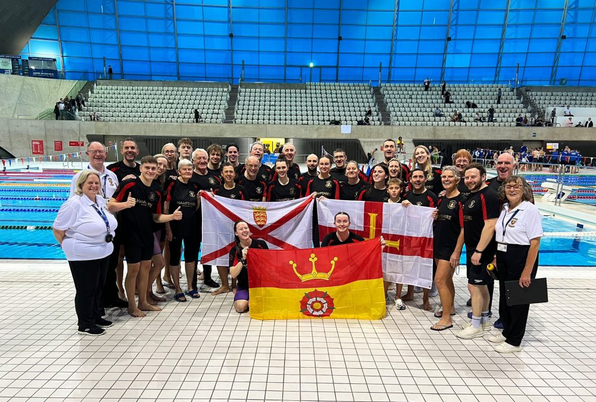

Hampshire and the Channel Islands have a number of active Masters clubs.  Essentially for those over 18 years, there are opportunities to swim for fun, fitness, and competition.  The county enters the Masters Inter-County competition every year, selecting the swimmers from different clubs to compete against neighbouring South East Regional teams (Kent, Sussex, Middlesex, Berkshire and Buckinghamshire, Surrey, Oxfordshire). The region is also the principle support for the Masters divisions of the Royal Navy and British Army.

If you want more information on where to find your nearest swimming club with a masters section, please use the Contact Us form. Alternatively, feel free to join our Facebook Group pages.[https://www.facebook.com/groups/813286518692141](https://www.facebook.com/groups/813286518692141)

Short Course Hampshire Masters Records (as of April 26) :

[Ladies and Mens Short Course Records Updated 1st Apr26V1 copy](/assets/uploads/2026/05/Ladies-and-Mens-Short-Course-Records-Updated-1st-Apr26V1-copy.xlsx)[Download](/assets/uploads/2026/05/Ladies-and-Mens-Short-Course-Records-Updated-1st-Apr26V1-copy.xlsx)

Long Course Hampshire Masters Records (as of April 26) :

[Ladies & Mens Long Course Records Updated 1stApr26](/assets/uploads/2026/05/Ladies-Mens-Long-Course-Records-Updated-1stApr26-1.xlsx)[Download](/assets/uploads/2026/05/Ladies-Mens-Long-Course-Records-Updated-1stApr26-1.xlsx)

Hampshire Masters Newsletter (April 26) :

[HantsMasters\_APR26\_1(Autosaved)\_compressed](/assets/uploads/2026/05/HantsMasters_APR26_1Autosaved_compressed.pdf)[Download](/assets/uploads/2026/05/HantsMasters_APR26_1Autosaved_compressed.pdf)
