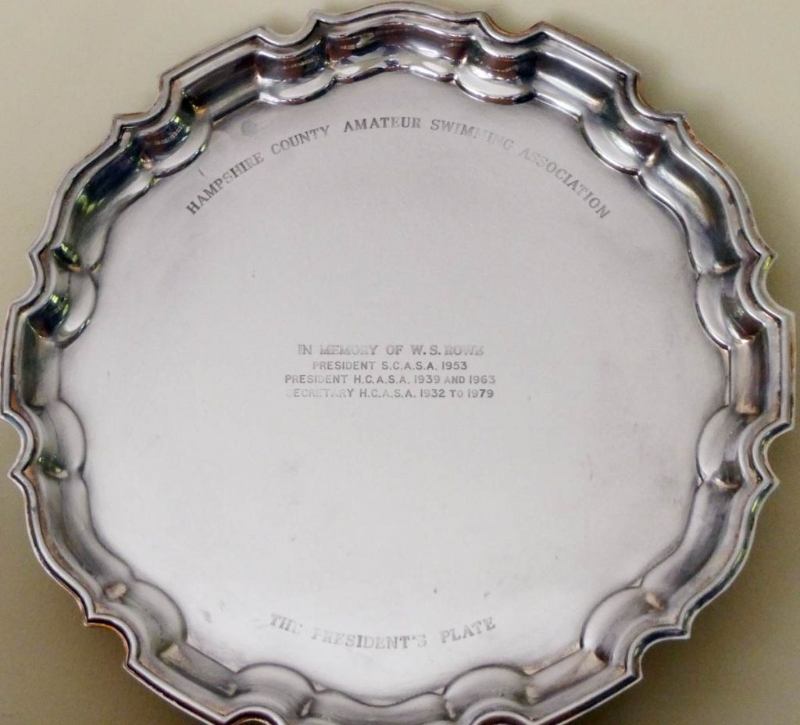

The W S Rowe Memorial Trophy, presented by the Association, shall be awarded annually for conspicuous service the Association. The recipient shall be nominated by the President.

<table class="table table-striped table-bordered">
  <thead class="thead-dark">
    <tr>
      <th>Year</th>
      <th>Trophy Winner</th>
    </tr>
  </thead>
  <tbody>
    <tr>
      <td>2025</td>
      <td>Natalie Ford</td>
    </tr>
    <tr>
      <td>2023</td>
      <td>Zoe & Mark Sadler</td>
    </tr>
    <tr>
      <td>2022</td>
      <td>Peter Harris</td>
    </tr>
    <tr>
      <td>2019</td>
      <td>Sue Lambert</td>
    </tr>
    <tr>
      <td>2018</td>
      <td>Graham Stanley</td>
    </tr>
    <tr>
      <td>2017</td>
      <td>David Greenaway</td>
    </tr>
    <tr>
      <td>2016</td>
      <td>Lynne Harrison</td>
    </tr>
    <tr>
      <td>2015</td>
      <td>Steve & Fran Harrison</td>
    </tr>
    <tr>
      <td>2013-14</td>
      <td>George Adamson</td>
    </tr>
    <tr>
      <td>2012</td>
      <td>Zoe Sadler</td>
    </tr>
    <tr>
      <td>2011</td>
      <td>Jean Dixon</td>
    </tr>
    <tr>
      <td>2010</td>
      <td>Julie Andrews</td>
    </tr>
    <tr>
      <td>2009</td>
      <td>Jenny Ball</td>
    </tr>
    <tr>
      <td>2008</td>
      <td>Catherine Beer</td>
    </tr>
    <tr>
      <td>2007</td>
      <td>Dennis Miles</td>
    </tr>
    <tr>
      <td>2006</td>
      <td>Janet Selley</td>
    </tr>
    <tr>
      <td>2005</td>
      <td>A;ex & Cyril Campbell</td>
    </tr>
    <tr>
      <td>2004</td>
      <td>Frank Clewlow</td>
    </tr>
    <tr>
      <td>2003</td>
      <td>John Ramsay</td>
    </tr>
    <tr>
      <td>2002</td>
      <td>Alan & Jan Alderman</td>
    </tr>
    <tr>
      <td>2001</td>
      <td>Mike Lambert</td>
    </tr>
    <tr>
      <td>2000</td>
      <td>Margaret & Joe Goring</td>
    </tr>
    <tr>
      <td>1999</td>
      <td>Pauline Hogg</td>
    </tr>
    <tr>
      <td>1998</td>
      <td>Margaret Ostler</td>
    </tr>
    <tr>
      <td>1997</td>
      <td>Jane Davies</td>
    </tr>
    <tr>
      <td>1996</td>
      <td>Edna Russell</td>
    </tr>
    <tr>
      <td>1995</td>
      <td>Margaret Goring</td>
    </tr>
    <tr>
      <td>1994</td>
      <td>Phyl & Don Kemp</td>
    </tr>
    <tr>
      <td>1993</td>
      <td>Mary Howe</td>
    </tr>
    <tr>
      <td>1992</td>
      <td>Joe Goring</td>
    </tr>
    <tr>
      <td>1991</td>
      <td>Barbara Firmin</td>
    </tr>
    <tr>
      <td>1990</td>
      <td>Roger & Margaret Loveman</td>
    </tr>
    <tr>
      <td>1989</td>
      <td>Wally Rendell</td>
    </tr>
    <tr>
      <td>1988</td>
      <td>Frank & Betty Lowther</td>
    </tr>
    <tr>
      <td>1987</td>
      <td>Eric Ransley</td>
    </tr>
    <tr>
      <td>1986</td>
      <td>Betty Lowther</td>
    </tr>
    <tr>
      <td>1985</td>
      <td>Leslie Howe</td>
    </tr>
    <tr>
      <td>1984</td>
      <td>Stanley Felgate</td>
    </tr>
    <tr>
      <td>1983</td>
      <td>Michael Firmin</td>
    </tr>
  </tbody>
</table>

